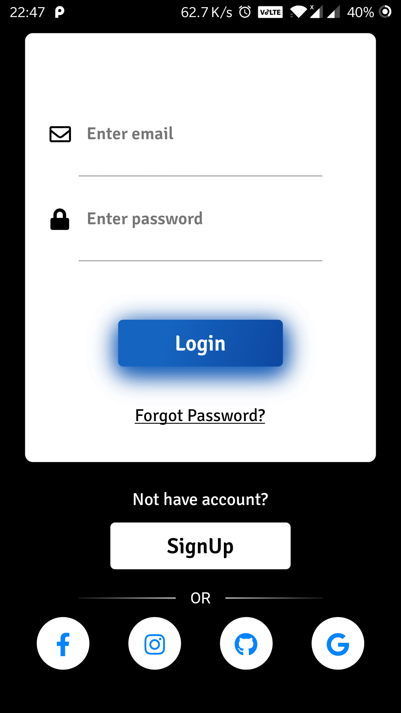
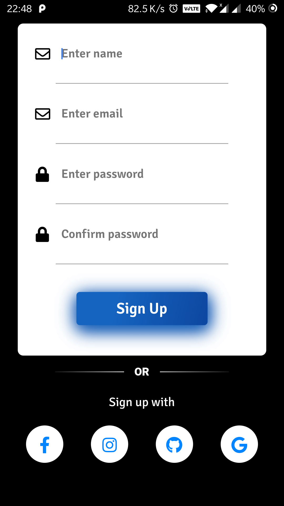

# Flutter Login

A new Flutter application which demonstrate sample app for login and signup

## Features
* Login page design
* SignUp page design

## Run project
#### Step 1. [Setting up Flutter](https://flutter.io/setup/)
#### Step 2. Clone the repo

```sh
$ git clone https://github.com/pranaypatel512/FlutterLogin.git
$ cd FlutterLogin
```
#### Step 3.
```sh
$ flutter run
``` 

### To-Do
- [x] Basic design
- [ ] Navigation animation
- [ ] Theming
- [ ] Form Validation

### Screenshots
| Login | SignUp|
| ------------------ | ------------------ |
|   |   |

## Welcome PR?
* Check out contribution guidelines [CONTRIBUTING.md](https://github.com/pranaypatel512/FlutterLogin/blob/master/CONTRIBUTING.md)


### License
Copyright 2019 Pranay Patel

Licensed under the Apache License, Version 2.0 (the "License"); you may not use this file except in compliance with the License. You may obtain a copy of the License at

http://www.apache.org/licenses/LICENSE-2.0

Unless required by applicable law or agreed to in writing, software distributed under the License is distributed on an "AS IS" BASIS, WITHOUT WARRANTIES OR CONDITIONS OF ANY KIND, either express or implied. See the License for the specific language governing permissions and limitations under the License.
